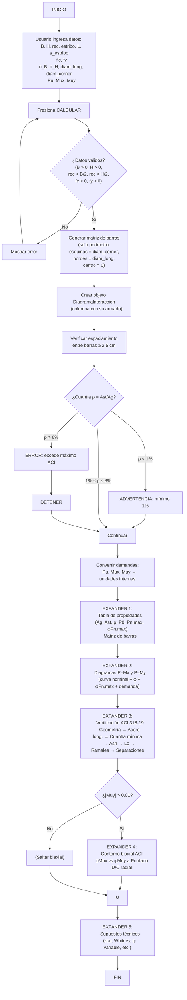
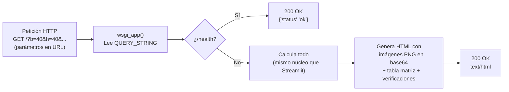

# Diagrama de Flujo — Programa de Diseño de Columnas ACI 318-19

## Flujo alternativo — Modo WSGI (Railway / servidor)

## Leyenda de formas

| Forma | Significado |
|-------|-------------|
| Rectángulo | Proceso / acción |
| Rombo | Decisión / condición |
| Rectángulo redondeado | Inicio / Fin |
| Rectángulo con doble línea | Subproceso / expansor |
